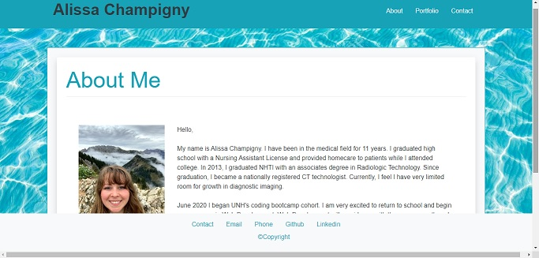

# Alissa Champigny's Portfolio

### UNH Coding Bootcamp Full Stack Web Development Student
June 2020 - December 2020

## Description

For more information about me and my work please check out my responsive portfolio.

## Table of Contents

* [Description](##Description)

* [Application link](##Application-Link)

<!-- *  -->

* [Technologies Used](##Technologies-Used)

* [Contact Developer](##Contact-Developer)

## Application Link

<!-- [Application Deployed on Heroku]() -->

 [Responsive Portfolio](https://achampigny4.github.io/AlissaC-ResponsivePortfolio/)

 

##

## Technologies Used

CSS, HTML, Bootstrap, getwaves.io

## Contact Developer

Feel free to contact me to collaborate or network.

[Alissa Champigny](https://github.com/achampigny4)

I look forward to hearing from you.

*Copyright (c) 2020 Alissa Champigny*